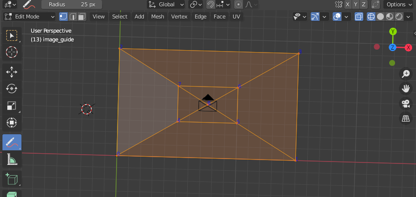
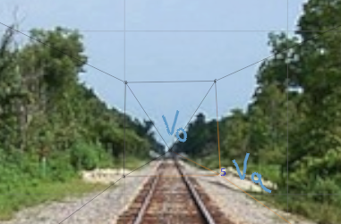
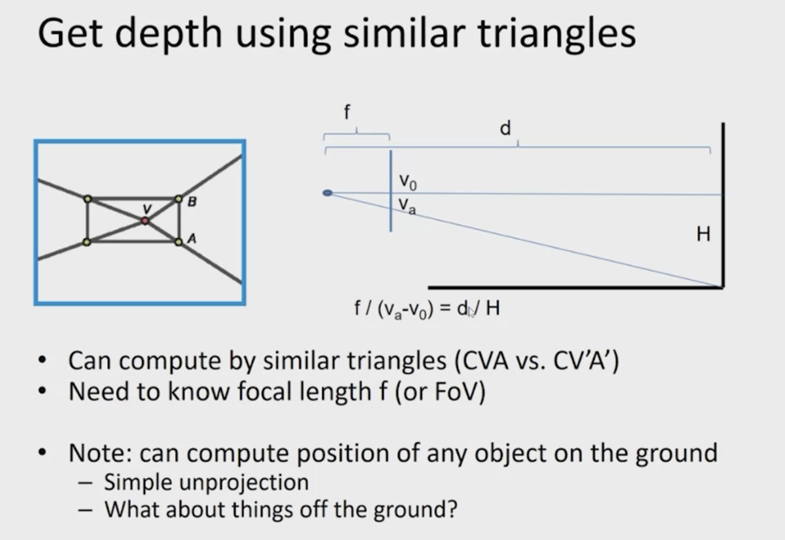
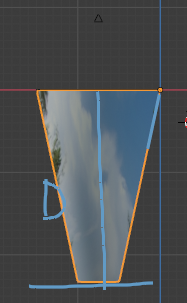
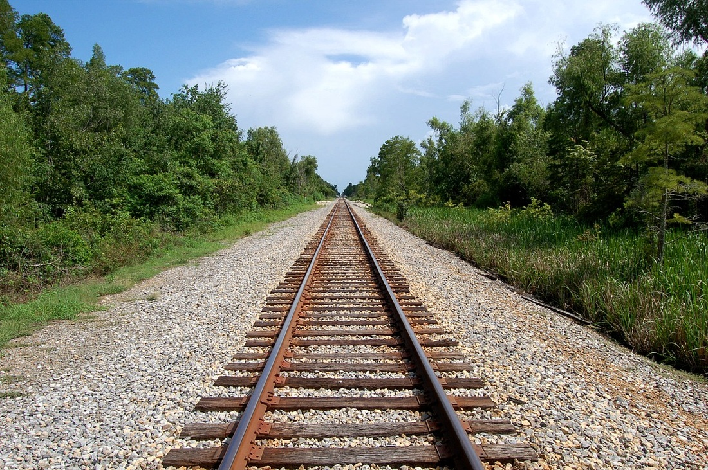
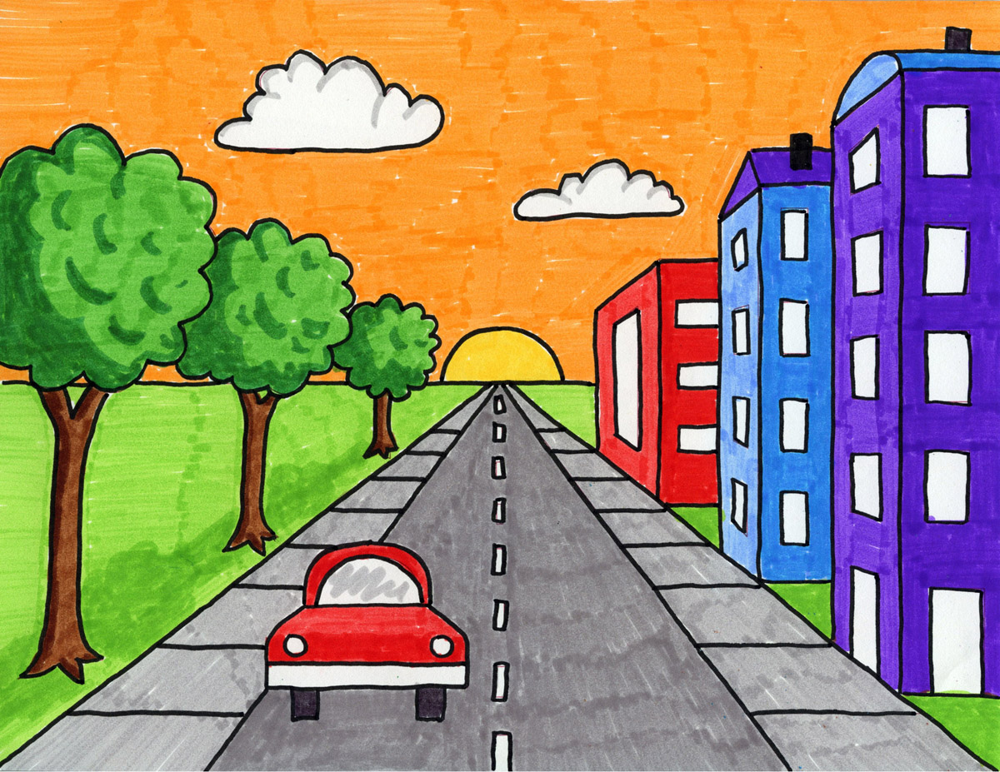
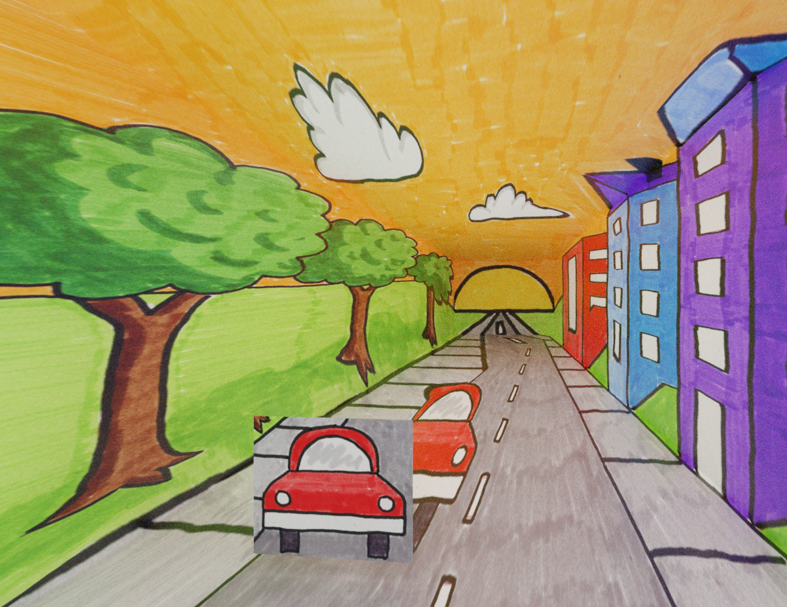
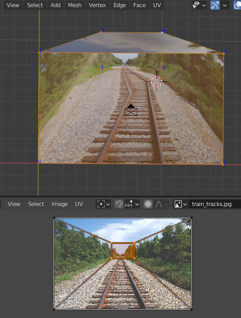
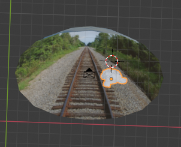
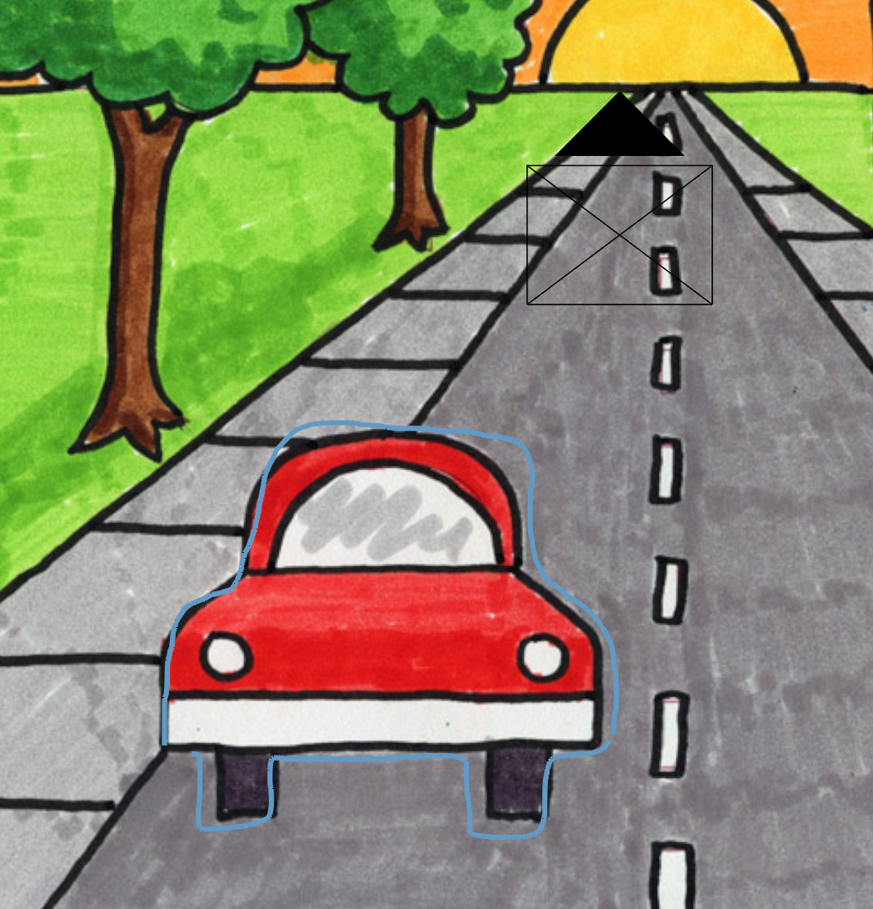

Name (netid): Nathaniel Rupsis (nrupsis2)
# CS 445 - Final Project: Blender Tour Into The Picture

Instructional overview: https://mediaspace.illinois.edu/media/t/1_7fphzpck

Source: https://github.com/rupsis/CS445-Final-Project
## Motivation and impact
I chose to implement the tour into the photo paper because I wanted an automatic way to bring my images to life. It's difficult to argue the "importance" of 2D image to 3D animation for this project, since the motivation is bring images to life for artistic purposes. This method could however be built upon, and used for something more useful (crime scene reconstruction, inserting objects into a 3D scene, etc).

## Approach
The approach I took to implement the "tour into the picture" was pretty much how it's implemented in the paper (from a conceptual standpoint). The first step was to create a grid system for the user to be able to set boundaries for:

Once the guide has been created, the user is then able to position the coordinates to create the back plane of the single point perspective, and set the vanishing point:

Once the user has finished their input, a script is executed to calculate the depth of the image based on the uses input and focal length (if available, else it's guessed). The method for obtaining the image depth is via similar triangles. (slide taken from lecture):

Setting the camera height to 1, we obtain the V0, and Va y position, and then calculate the depth. 

D = H * ( F / (V0 - Va))

Once the depth has been calculated, the original guide mesh is then transformed into a 3D object, and the texture image is then UV projected onto it, creating a 3D representation of our image. 

## Results

The results of the 3D recreation are listed below. From a 2d image, i was able to successfully reconstruct a single point perspective image in 3D. This allows me to create an animated fly through, and capture new scene perspectives. 

Original:

3D recreation:

Link to animated fly through: https://mediaspace.illinois.edu/media/t/1_ovuu6mw6

(Note, there is a weird texture glitch. The first half of the animation is washed out (explained below), and the last part seems to be fine. I think this is due to an incorrect texturing issue on the mesh material)

Original:

3D recreation:

Link to animated fly through: https://mediaspace.illinois.edu/media/t/1_r7hhdtne

The paper mentions that the foreground mask was prepared in advance. I chose not to create an image mask to illustrate where/how the image mask would be applied. A potential future feature would be automatically creating foreground masks, and potentially even using texture synthesis to fill in the background image. 

One side effect of using a 3D engine (or perhaps my lack of knowledge in this domain) is the lighting. You'll notice the 3D recreation is a bit more washed out than the original. This is due (or so I believe) to the ambient occlusion added to light the scene. One _potential_ method would be to take the source image, and use that as a lighting texture for a large plane light. This would recreate the lighting (to a degree) of the scene.

Overall, I'm pretty happy with the results. I was pretty overwhelmed at the beginning of the project, but I was able to achieve some decent results, and i have a solid project foundation that I can build upon.

## Implementation details
[Blender](https://www.blender.org/), is the 3D engine I used to create the 3D mesh, and render out the images / animations. Blender exposes a [python api](https://docs.blender.org/api/current/index.html) that allows you to control a majority of features withing Blender. I used a sequence of python scripts executed in Blenders interpreter to achieve the final results. 

References used while learning Blender:
* https://blender.stackexchange.com/ 
* https://blenderartists.org/c/coding/13
* https://docs.blender.org/api/current/index.html
* https://sinestesia.co/blog/tutorials/python-2d-grid/

## Challenge / Innovation
The largest challenge in this project was learning how the blender programming system worked. Blender provides a incredibly rich toolset for creating 3D graphic, however, their python API documentation is lacking... A majority of the time spent was figuring out how to achieve something within blender. 

The largest deviation from the paper, is the how we go about modeling the 3D mesh. The same calculations for determining scene height and depth are used, however in my method, the guidelines provided to the user are transformed into a continuous mesh model, rather than creating individual planes. To recreate the individual plane appearance, the single mesh object's texture (source image) is projected onto the mesh from the cameras perspective:

The benefit of having a single piece of mesh, is the ability to add a Subdivision modifier, which takes the original mesh, and subdivides it, thus creating a smooth mesh. The results is smooth correctly mapped 3D object of the 2D image:

## Future work
This project is still in it's infancy. While we were able to achieve some decent results with the current implementation, it's not super intuitive or user friendly. The next step for this project would be to move the sequence of scripts into a collection of UI elements, and create a structured flow for the user.

Additionally, the addition of foreground object is cumbersome, and the results (without any additional modeling from the user) aren't that great. We're able to achieve bounding box geometry, but it would be great to achieve actual object silhouetting. On of the next features I'd like to implement, is the ability for the user to draw object boundaries, rather than having to create a bounding box, and it automatically create a mesh. (Exp below)

## Credits
* [Blender](https://www.blender.org/)
* [Train Tracks](http://orthographic.weebly.com/uploads/1/7/3/2/17321634/8720148_orig.jpg)
* [City](https://artprojectsforkids.org/draw-a-city-with-one-point-perspective/)